# Build guide

## Introduction

The ximi v1 comes with most of the required components pre-soldered. The only required components that you need to solder are hotswap sockets and TRRS.

That said, there are many optional components that you may want to include, which also need to be soldered.

Note: You may see some blue through hole resistors in some of the pictures below. Those are *not* needed.

This includes:
* Per key leds (SK6812 mini-e)
* Haptic feedback
* Trackball breakout board
* EC11 encoders
* Trackball sensor (to trackball breakout pcb)
* Cirque Trackpad

Please see the pictures below to see how everything is soldered.

The recommended order for soldering is:
* Per key leds
	* Should be soldered on the bottom side, with the led facing down. Be sure to solder the lead of the led that has a cut in it such that it's aligned with the triangle silkscreen.
* Hotswap sockets
* Trackball wires (to the main PCB, but not the trackball breakout pcb)
	* Solder them so that the wires run along the bottom side of the pcb. Recommendation is to use different color wires so you don't mix them up when soldering to the trackball breakout pcb.
* Pimoroni haptic feedback
	* First we'll solder the headers. The pcb should be on the bottom.
	* The black plastic should be on the bottom, with the leads going through. You will solder the top side.
	* After soldering, use some flush cutters to cut in between the black plastic on the bottom side. Be careful not to let the blade cut the pcb.
	* Use long nose pliers (or even the flush cutters) to pull the black plastic off of the leads.
	* Lastly, cut anything sticking out of the TOP side of the pcb, since you'll need to solder the EC11 encoders on top
	* If you plan on using EC11, do *NOT* solder the haptic feedback module yet. If you don't plan on using EC11, you can solder it now if you like.
* TRRS
	* Should be on the top side of the pcb with the leads going through to the bottom
* EC11
	* Should be on the top side of the pcb with the leads going through to the bottom
	* Be sure to cut the leads as flush as possible after soldering if you are using a haptic feedback module
* Finish haptic feedback module
	* Put the haptic feedback module with the silver part facing up. It should go through the hole in the pcb.
	* If you have an EC11 encoder in, you may want to put some non-conductive tape over the hole and EC11 leads to make sure nothing conducts
	* Solder the haptic feedback leads. Remember that to make this as flush as possible, you should have removed the black plastic from the headers in the previous step.
* Trackball sensor (to trackball breakout pcb)
	* Solder the trackball sensor on the bottom of the trackball breakout pcb, with the leads going up through to the top. Be sure to align the little dot on the back of the sensor with the circle on the breakout pcb. This also has a square through hole pad.
* Trackball connectivity (from the main pcb to the trackball breakout)
	* Option 1: FPC cable: Use a 12 position 0.5mm pitch Type A fpc cable to connect the pcb to the breakout board. Be sure to set the switch on the back of the pcb to Ball (as opposed to Pad)
	* Option 2: Soldered wires: Run the wires through the bottom of the trackball breakout and solder from the top. Then cut the wires flush from the top. They should be in the opposite order from the main pcb. See the pictures below to make sure you do this correctly. 
* Cirque trackpad connection
	* When using the trackpad, make sure you set the switch on the back of the pcb to "Pad"
	* Please note that this only applies if you have a ximi v1. If you have a v1.1 or later, you do not require this step. You need to remove the R1 resistor from the back of the cirque trackpad. There is an example of me doing it for the a rock on build in this video: https://www.youtube.com/watch?v=LKTFEaT3yzU&t=1686s
	* If you did remove the R1 resistor in the previous step, you will need to update the ximi firmware to use i2c. Look for `POINTING_DEVICE_DRIVER := cirque_pinnacle_spi` in the file `keyboards/fingerpunch/ximi/rules.mk`, and change it to use `cirque_pinnacle_i2c` instead.
	* Also, you may need to remove the overlay. It's a known issue on some cirques. I'd recommend first testing before removing it. If you're seeing erratic movements or inconsistency, it's likely this. Video of this process is here: https://www.youtube.com/watch?v=_9lTZ1vEtGA&t=2s&ab_channel=fingerpunch
	* You can make your own replacement overlay by cutting some vinyl stickers, and placing it on top. Or you can buy some pre-cut ones here: https://www.etsy.com/listing/1317302992/cirque-trackpad-cover-35mm

## Pictures

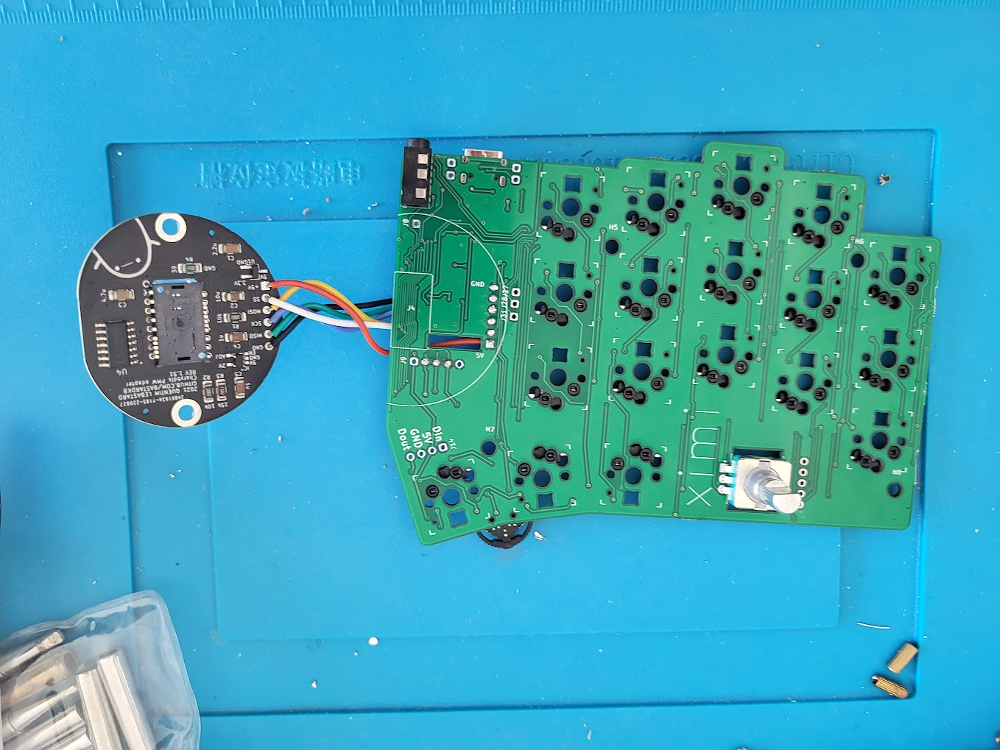

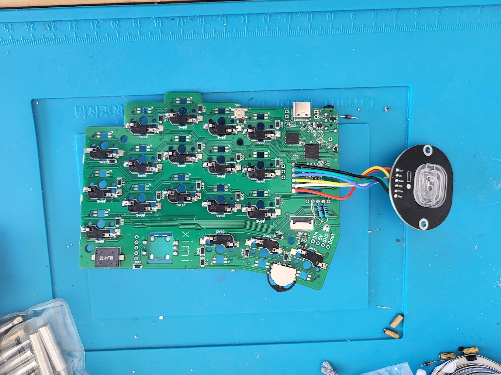

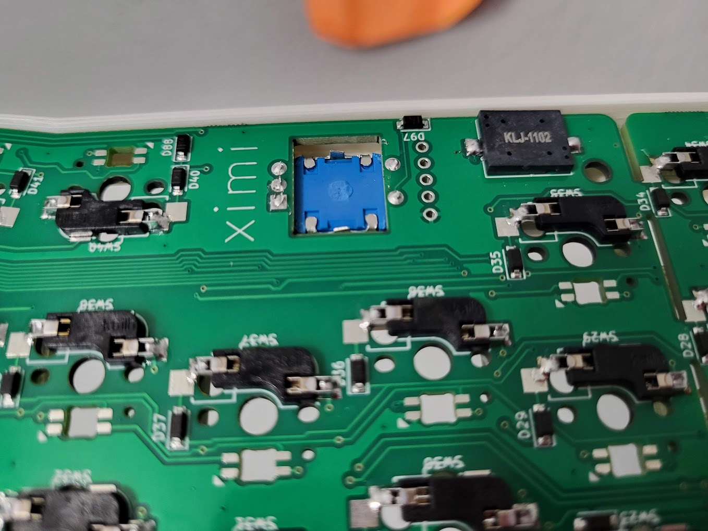

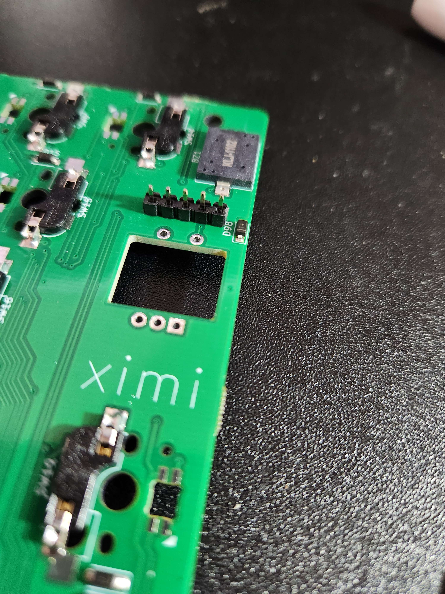

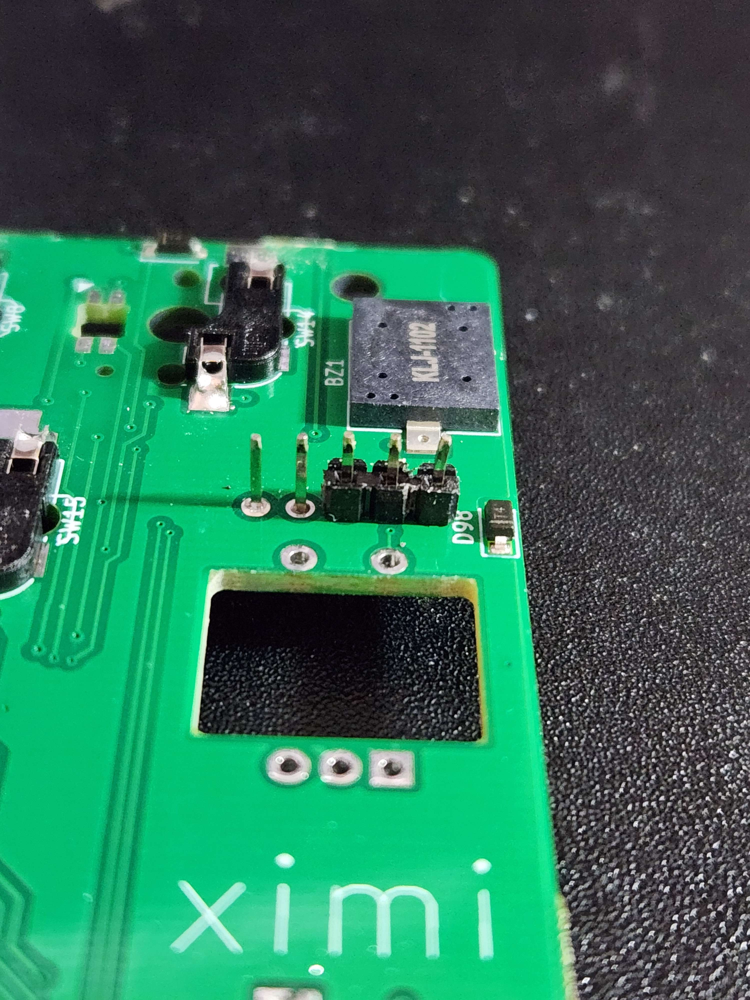

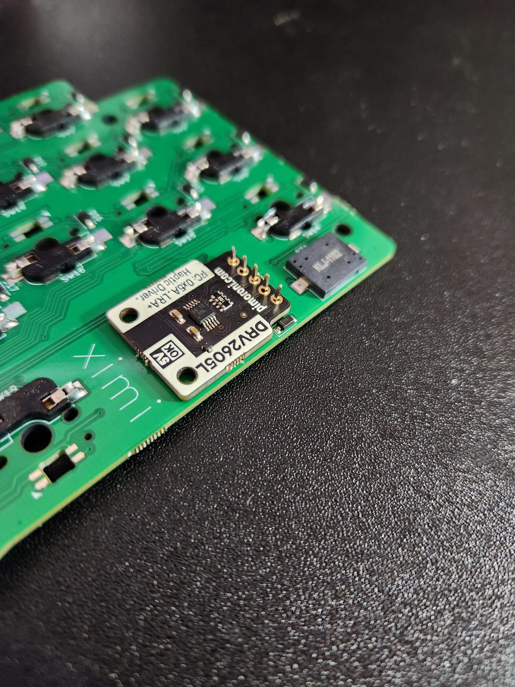

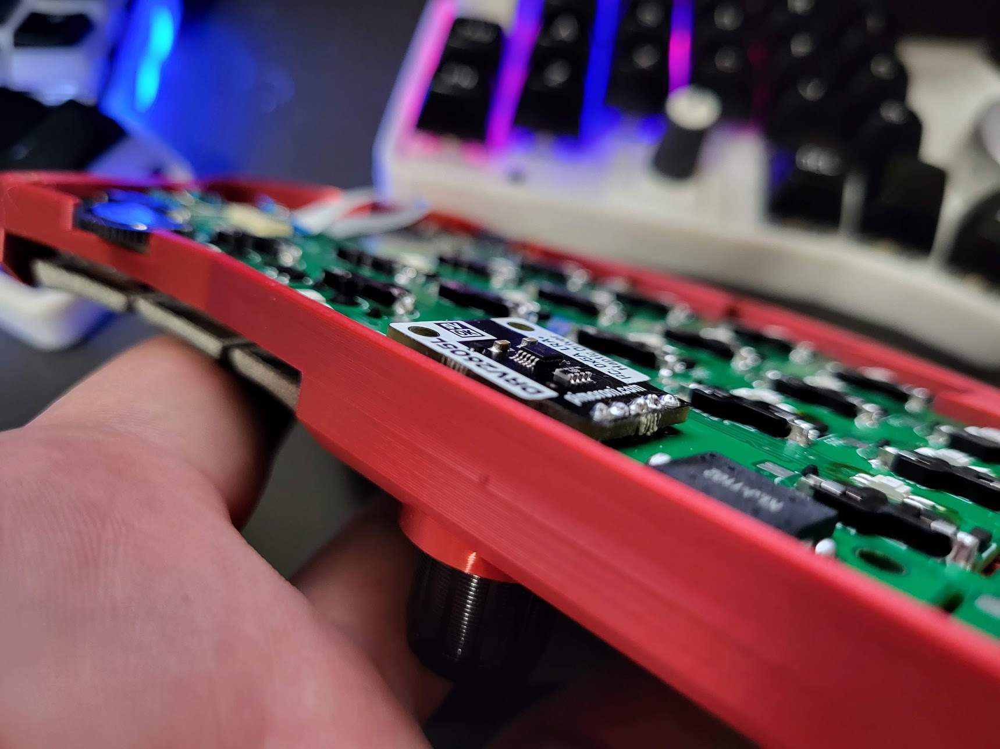

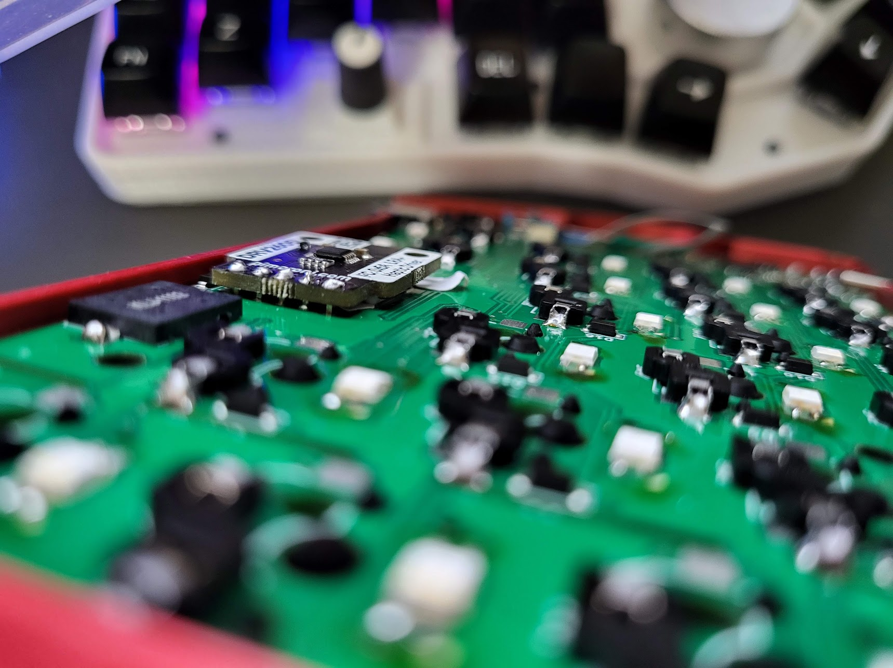

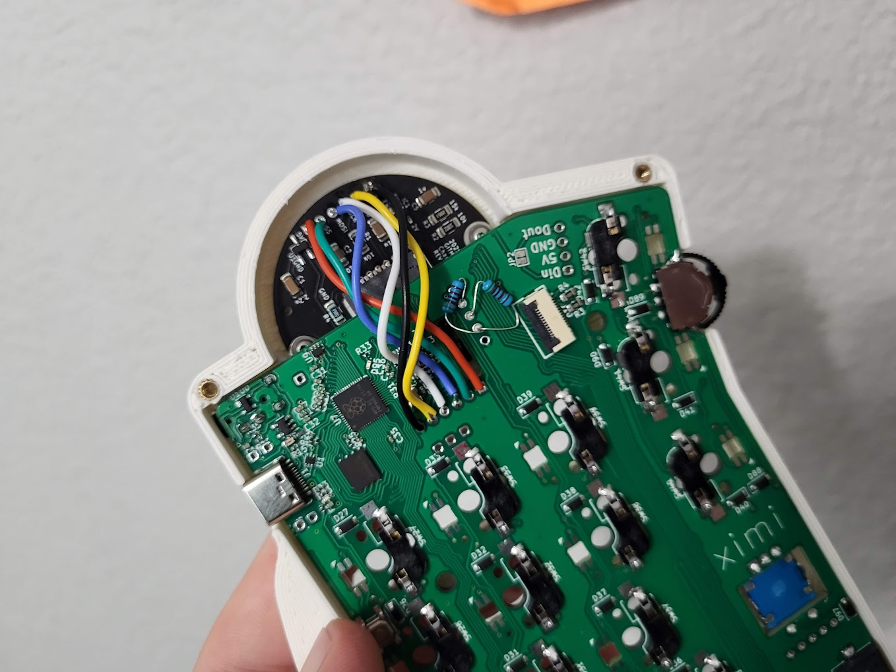

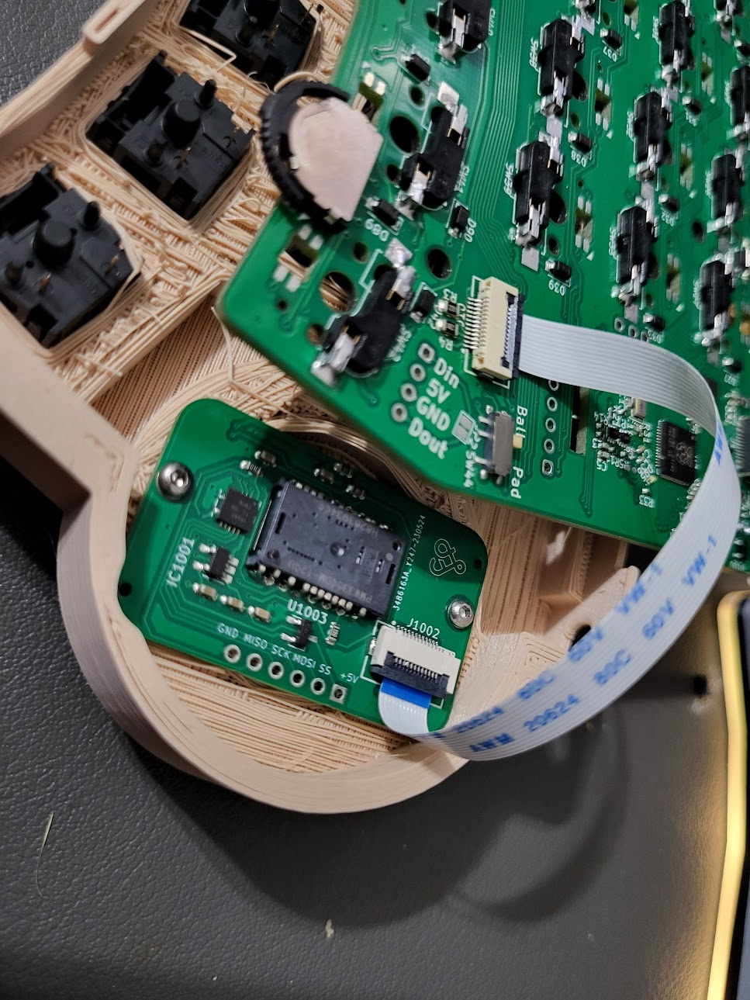

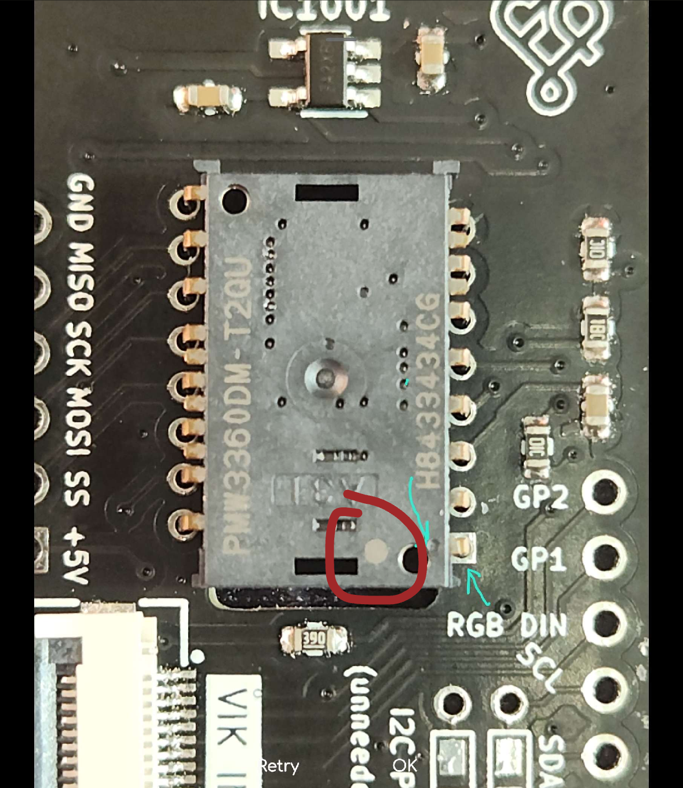
